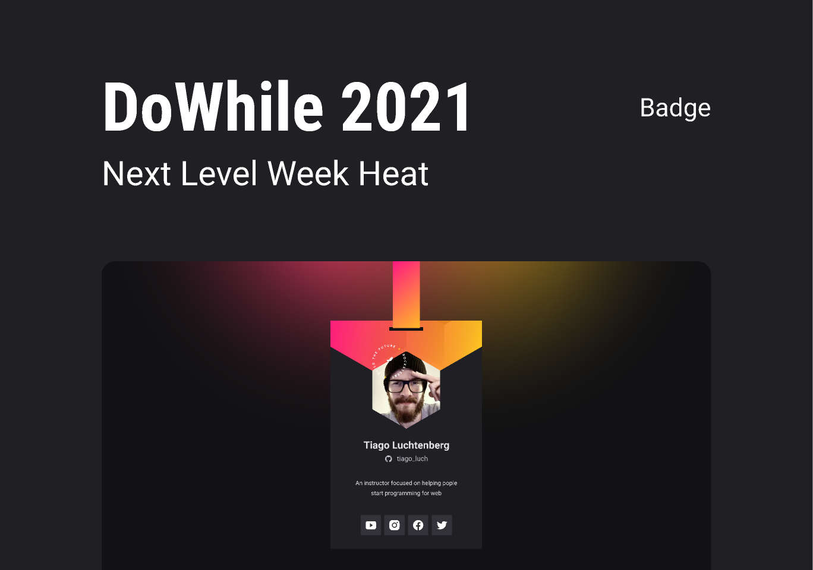

<h1 align="center">:man_astronaut: Mission: Origin :comet:</h1>

  <a href="https://rogeriofrsouza.github.io/nlw-heat/" target="_blank">Page</a>&nbsp;&nbsp;&nbsp;|&nbsp;&nbsp;&nbsp;
  <a href="#-tech-stack">Tech Stack</a>&nbsp;&nbsp;&nbsp;|&nbsp;&nbsp;&nbsp;
  <a href="#-project">Project</a>&nbsp;&nbsp;&nbsp;|&nbsp;&nbsp;&nbsp;
  <a href="#-layout">Layout</a>&nbsp;&nbsp;&nbsp;|&nbsp;&nbsp;&nbsp;
  <a href="#-license">License</a>

 

  

 

## 🚀 Tech Stack

This project was developed using these technologies:

- 
  &nbsp;HTML
- 
  &nbsp;CSS
- 
  &nbsp;JavaScript

Libraries:

- [Google Fonts](https://fonts.google.com/)

Utilities:

- [lorempixel](https://lorempixel.com/185/185/people/)
- [Clippy](https://bennettfeely.com/clippy/)

 

## 💻 Project

- OriginSix is an institutional page in **Single Page** format and also **Responsive**. Can be used by micro, small and medium-sized enterprises. 
- Contains the following sections: Header, Navigation, Home, About, Services, Testimonials, Contact and Footer.
- You can watch the full course [here](https://app.rocketseat.com.br/node/mission-origin-heat).
- NLW Heat [tracks](https://app.rocketseat.com.br/nlw-heat/tracks).

 

## 🔖 Layout

You may check the project layout [here](https://www.figma.com/community/file/1031698737363668691). You will need an account on [Figma](https://figma.com).

 

## 📝 License

This project is under MIT License. You can check [LICENSE](https://github.com/rogeriofrsouza/nlw-heat/blob/main/LICENSE) for more details.

 

---

Made with ♥ by Rocketseat :wave: [Discord community!](https://discordapp.com/invite/gCRAFhc)
